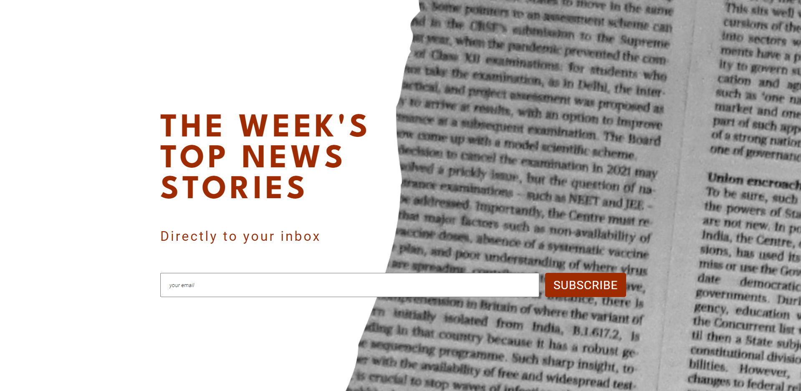

<h1 align="center">Daily-UI-01</h1>

First project for <a href="https://www.dailyui.co/">Daily UI's</a> 100 Days of UI Challenge. The prompt was to create a sign-up form for anything you could think of. I chose a basic news-aggregating subscription service and created this appealing user interface. I struggled to achieve the ripped-paper effect with pure CSS before eventually deciding to create a ripped paper image myself and use that as the background.

## Links

- [Repo](https://github.com/kelseychristensen/Daily-UI-01.git "Daily-UI-01 Repo")
- [Dribbble](https://dribbble.com/shots/20017812-Daily-UI-Day-001-Sign-Up-Form "Daily-UI-01 Dribbble Snapshot")

## Screenshots

## Built With

- HTML
- CSS

## Author

Kelsey Christensen

- [Profile](https://github.com/kelseychristensen "Kelsey Christensen")
- [Email](mailto:kelsey.c.christensen@gmail.com?subject=Hi "Hi!")
- [Dribble](https://dribbble.com/kelseychristensen "Hi!")
- [Website](http://kelseychristensen.com/ "Welcome")
